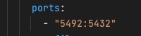
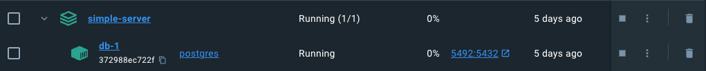
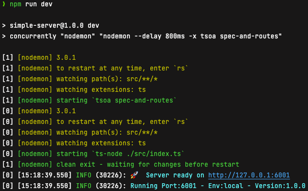
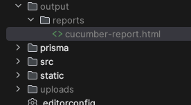
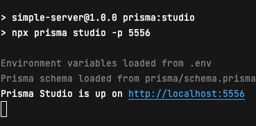
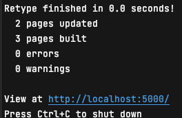

## Intro
This is a simple boilerplate project to demo some production ready principals and theories  


## Prerequisites 
To get the project up and running you will need a few things to get you going

* Node/Npm - We recommend using nvm to allow easy version switching 
* Docker - In particular docker desktop
* Globals - There are a few global npm packages needed: `npm i -g artillery retype`

## Running the project locally
The following instructions will help get the project up and running locally

### npm install
One of the first things you will need to do is run the install command to install all dependencies
```shell
npm install
```

### Postgres Database

To get the project up and running locally you will first have to spin up the database into a docker container. 

Copy the `.env.posgres.example` file and rename it to just `.env.postgress` the file contains the details for the user and database that will be created when the server spins up

*Note: Ports - The compose filehas the ports set to a specific none standard port as this was an easy way to avoid conflicts with other postgres servers that may be running.*



From the root of the project
```shell
docker-compose up -d
```

You should then be able to see the database is running in docker desktop (or similar)


Once the database is running you can apply the migration to set up the local database

```shell
npx prisma migrate dev
```

This will make sure the database is up and running with the correct tables and schema.

From here you will be able to start the server 
```shell
npm run dev
```
You should see a successful message in the console


From here you will be able to run the e2e tests via cucumber to see if things are all doing what they are expected to.

```shell
npm run test:cucumber
```

There will be a summarised report in the console as well as a html file with a more detailed report. This can be found in the output folder at the root of the project. Simply open it with Chrome or another browser



To view the records that have been generated during the tests you can use the prisma studio.

```npm run prisma:studio```



## Documentation
The readme file contains some basic info for getting the project up and running but there are more in-depth documents for individual sections

### API
The api uses [tsoa](https://tsoa-community.github.io/docs/getting-started.html) to auto generate swagger documentation for the api. When the server is up and running this is available by visiting [http://localhost:6001/docs](http://localhost:6001/docs)

### Platform Documents
As there are a number of key areas that we wanted to write more information about we decided to use [retype](https://retype.com/guides/getting-started/) to produce some more in-depth documentation covering areas such as testing, resources, tech choices etc.

To get this up and running locally there needs to be a global install then running the command.

```shell
npm i -g retypeapp
retype start
```

You should get a message similar to:



The MD files used to generate these docs are located in the `/docs` folder the meta data is seperated into yml files
